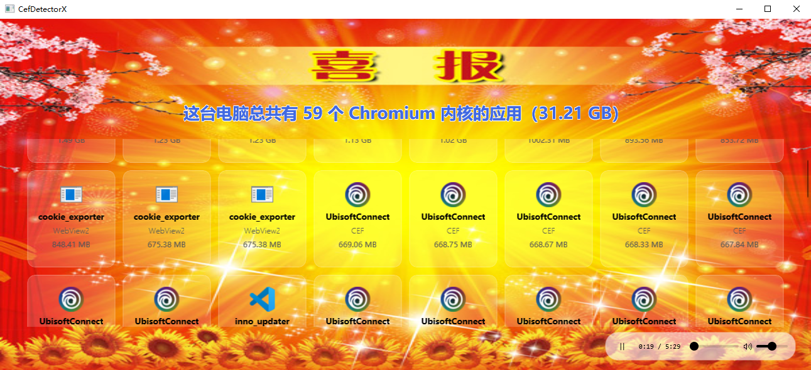

# CefDetectorPlus - 一眼CEF Plus: 年轻人的第三款 Windows CEF检测器

> 基于 WinUI 3 的 Windows Chromium 内核应用检测工具 —— CefDetectorX 的增强版

[](https://dotnet.microsoft.com/)
[](https://learn.microsoft.com/windows/apps/winui/)
[]()

## 简介

**CefDetectorPlus** 是一款 Windows 平台下的 Chromium 内核应用检测工具，能够精准扫描并统计你电脑中所有基于 Chromium Embedded Framework（CEF）、Electron、NW.js、Qt WebEngine、MiniBlink 等浏览器内核的桌面应用程序。

你是否好奇过：VS Code、Steam、微信、QQ、Teams、Postman、Discord……这些看似无关的软件，背后都运行着同一个浏览器内核？CefDetectorPlus 帮你一键揭晓答案。

## 界面



## 功能特性

- 覆盖 CEF、Electron、NW.js、Qt WebEngine、WebView2、MiniBlink、CefSharp 等所有主流 Chromium 内核
- 三级优先级引擎识别（Specific > Medium > Generic）+ PE 文件特征码扫描，准确识别重命名 exe 的 Electron 应用
- 调用 [Everything](https://www.voidtools.com/) 搜索引擎，秒级完成全盘扫描；未安装 Everything 时自动回退文件系统扫描
- 显示当前所运行的进程 (绿色文件名)
- 内置 BGM 播放控制
- 单独显示每个程序的空间占用并按大小排序，
- 可以通过添加参数 --no-bgm 的形式来关闭背景音乐

## 系统要求

- Windows 10 1809+ 或 Windows 11
- [.NET 10.0 Desktop Runtime](https://dotnet.microsoft.com/download/dotnet/10.0)（绿色版自带运行时）
- （推荐）[Everything](https://www.voidtools.com/) 已安装并运行，大幅提升扫描速度

## 快速开始

### 方式一：绿色版（推荐）

1. 从 [Releases](https://github.com/hao-wanted-to-cry/CefDetectorPlus/releases) 下载 `CefDetectorPlus_green.zip`
2. 解压到任意目录
3. 双击 `CefDetectorPlus.exe` 运行

~~### 方式二：MSIX 安装包~~

1. 从 [Releases](https://github.com/hao-wanted-to-cry/CefDetectorPlus/releases) 下载 `CefDetectorPlus_x64.msixbundle`
2. 双击安装

## 构建

```bash
# 安装 .NET 10.0 SDK
# https://dotnet.microsoft.com/download/dotnet/10.0

# 克隆仓库
git clone https://github.com/hao-wanted-to-cry/CefDetectorPlus.git
cd CefDetectorPlus

# 构建
dotnet build -c Release

# 发布绿色版
dotnet publish -c Release -r win-x64 --self-contained -o ./output
```

## 技术架构

| 模块 | 技术 |
|------|------|
| UI 框架 | WinUI 3（Windows App SDK 2.2） |
| 运行时 | .NET 10 |
| 搜索引擎 | Everything SDK（es.exe 命令行） |
| 注册表扫描 | 64/32 位 HKLM + HKCU 全覆盖 |
| PE 扫描 | `ReadOnlySpan<byte>.IndexOf` 向量化硬件加速 |
| 并行处理 | `Parallel.ForEach` |
| 打包 | MSIX + self-contained 绿色版 |

## 检测原理

1. **Everything 搜索**：通过 es.exe 正则匹配签名文件（`_100_*.pak`、`libcef*.dll`、`node*.dll` 等）
2. **注册表扫描**：遍历 HKLM/HKCU 的 Uninstall 注册表项，匹配 DisplayIcon 路径
3. **PE 特征码扫描**：对 exe 文件读取全量二进制，搜索引擎特征字符串确认内核类型
4. **MSIX 扫描**：通过 `PackageManager` API 获取 AppX 包的 InstalledLocation
5. **文件系统兜底**：无 Everything 时从驱动器根目录搜索，深度 5 层

## 项目结构

```
GoodNewsBrowserAppDetector/
├── MainWindow.xaml          # 主窗口 UI（毛玻璃卡片 + 音乐播放器）
├── MainWindow.xaml.cs       # 主窗口逻辑（实时检测 + 交互控制）
├── Models/
│   └── BrowserBasedApp.cs   # 应用数据模型
├── Services/
│   └── AppDetector.cs       # 核心检测引擎
├── Assets/                   # 资源文件（背景图 + BGM）
├── es.exe                    # Everything 命令行工具
└── Package.appxmanifest      # MSIX 打包配置
```

## 免责声明

本项目仅供学习和研究使用。检测结果仅反映软件使用的浏览器内核技术栈，不代表软件功能性评价。

## 致谢

- [CefDetectorX](https://github.com/shigophilo/CefDetectorX) - 灵感来源和检测思路参考
- [Everything](https://www.voidtools.com/) - 极速文件搜索引擎
- [Windows App SDK](https://learn.microsoft.com/windows/apps/windows-app-sdk/) - WinUI 3 框架

## License

MIT
